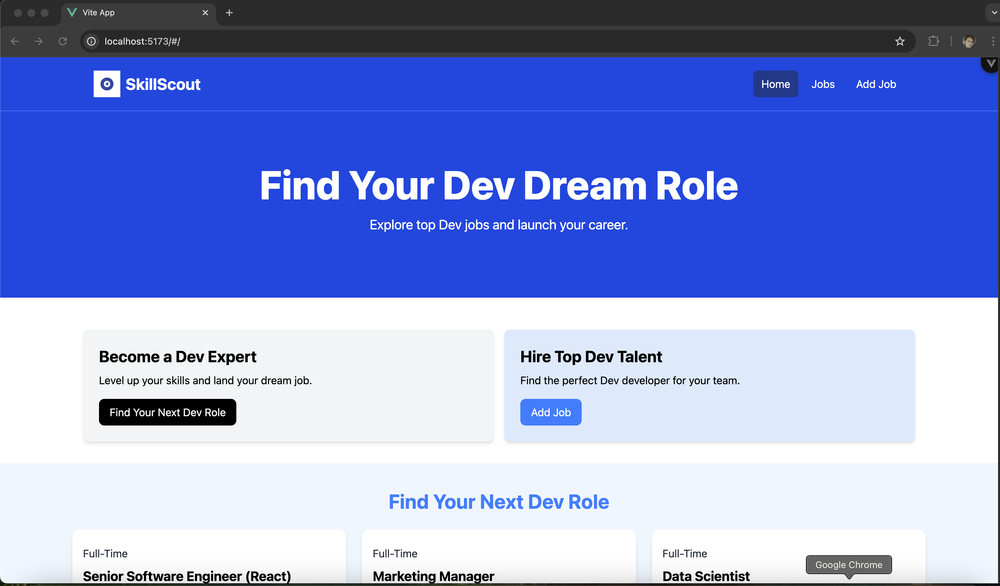
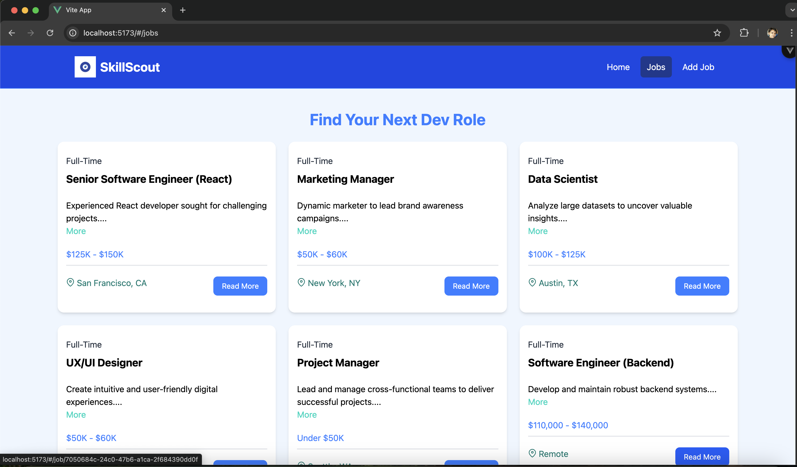
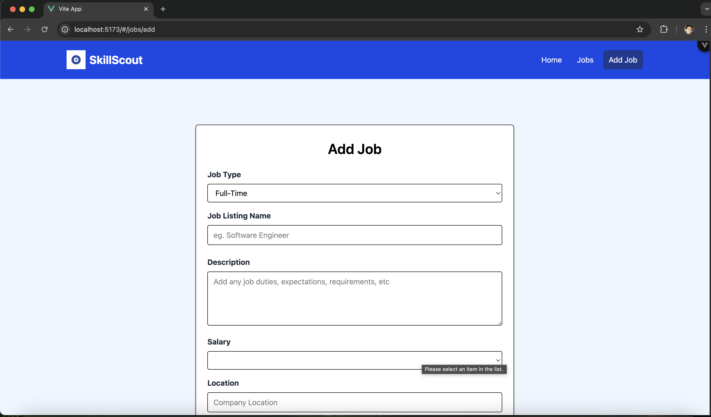
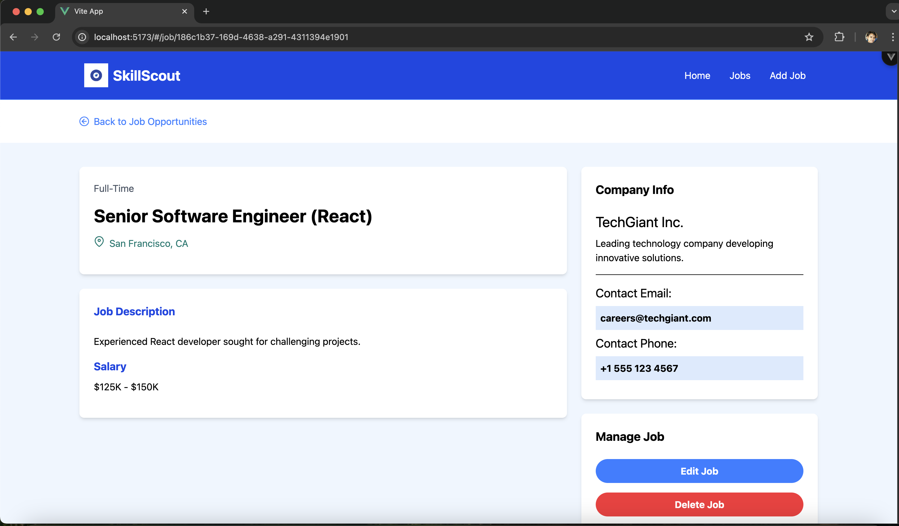
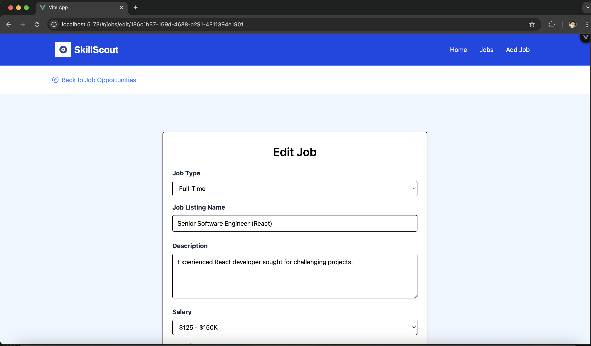
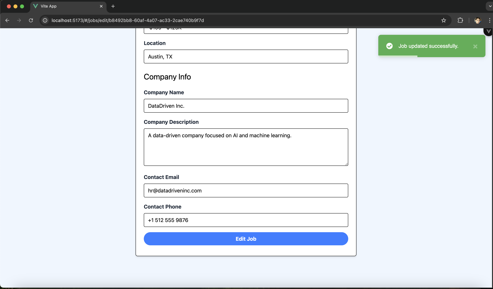

# SkillScout Job Board

This project is a job board application built with:

* **Frontend:** Vue.js 3, vue-router, axios
* **Backend:** Node.js, Express.js, Mongoose
* **Database:** MongoDB

**Features:**

* **Home Page:** Welcoming landing page with a brief introduction to SkillScout.
    * Prominent calls to action for job seekers and employers.
* **Job Listing:**
    * Search and filter jobs by keywords, location, job type, salary, and skills.
    * View detailed job descriptions, including company information and contact details.
* **Add Job (Employer Dashboard):**
    * Create and manage job postings.
    * Intuitive form for entering job details (title, description, requirements, company information).
* **Job Management:**
    * Edit and update existing job postings.
    * Delete job postings.

**Getting Started:**

1. **Clone the Repository:**
   ```bash
   git clone https://github.com/janaka120/job-finder.git

2. **Install Dependencies:**
    ```bash
    cd job-finder
    npm install

Backend:
    ```bash
    cd jobs-node-project
    npm install

3. **Start MongoDB:**
    ```bash
    sudo mongod --dbpath=/path-users/user/data/db

4. **Run the Backend Server:**
    ```bash
    cd jobs-node-project
    npm start

5. **Run the Frontend Development Server:**
    ```bash
    cd job-finder
    npm run dev

6. **Access the Application:**
Open your web browser and navigate to http://localhost:5173 to access the SkillScout application.

7. **Screenshots:**
Home Page: 
Job Listing Page: 
Add Job Page: 
Job Details Page: 
Edit Job Page: 
Notification: 
Responsive Home Page: 

**Note:**

Environment Variables:
You might need to configure environment variables (e.g., MongoDB connection string) in your backend server. Refer to the server.js file for specific instructions.

Database:
Ensure your MongoDB database is running and accessible before starting the backend server.